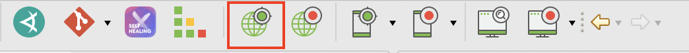
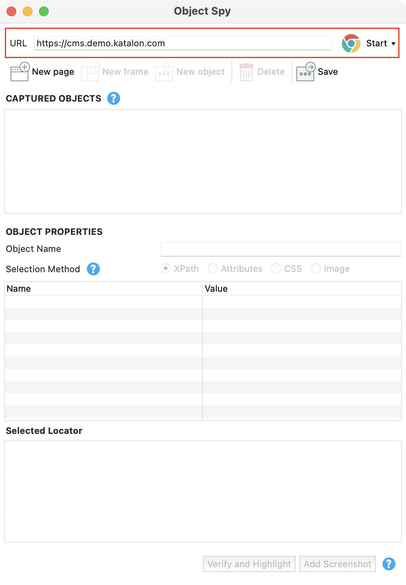
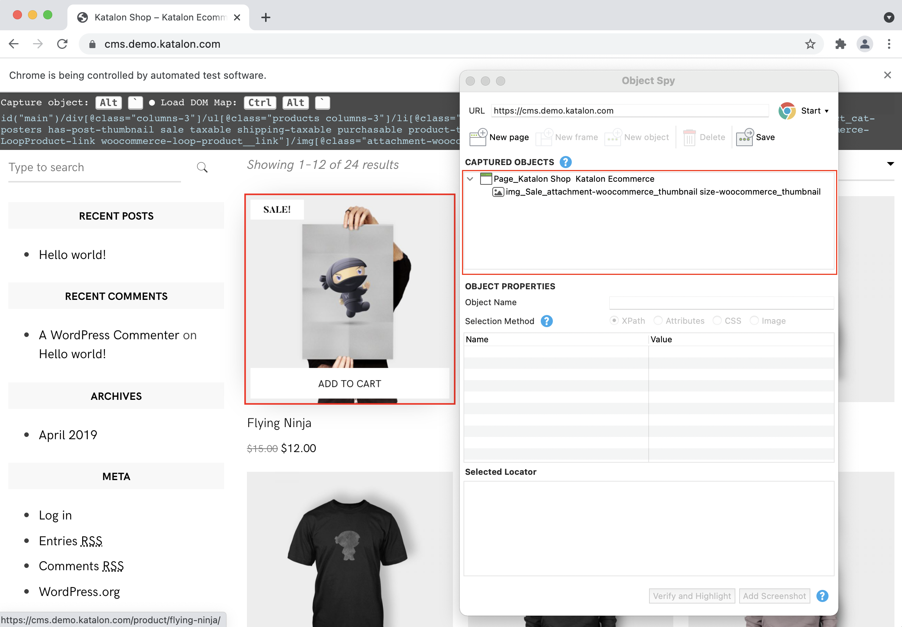
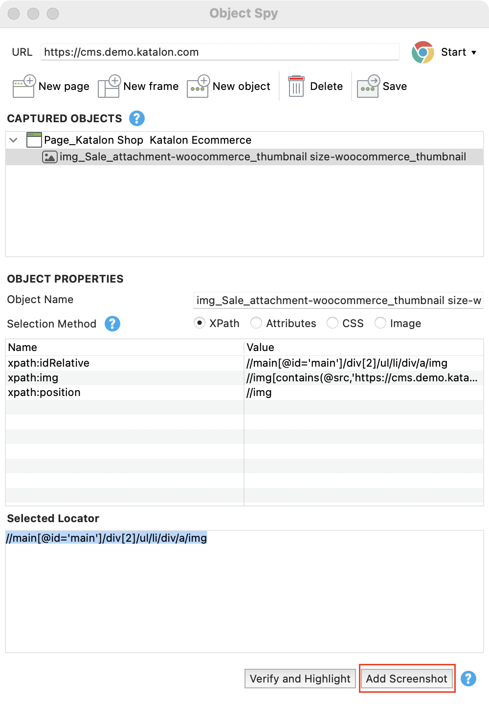
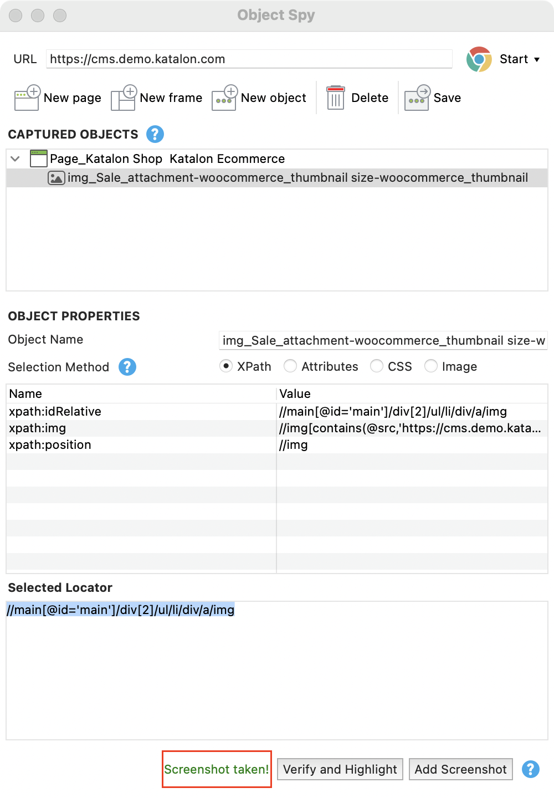
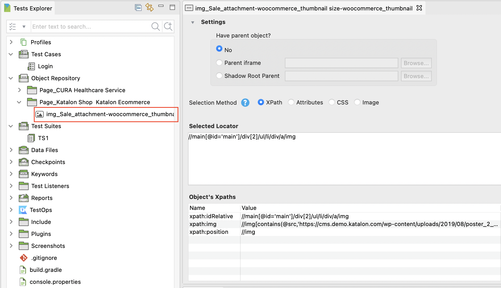
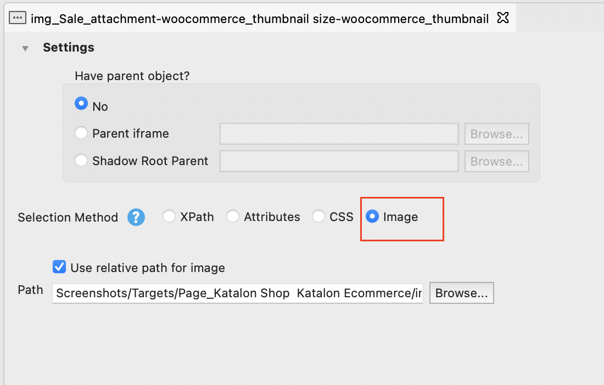

# 基于图像的Web自动化测试
> 要求：

1. Katalon Studio的版本大于7.2.2
2. 激活状态的Katalon Studio企业版

Katalon Studio提供了一个图像定位器方法来将测试对象与图像关联起来。使用此方法，您可以在测试下的web应用程序(AUT)的元素保持其外观时执行基于图像的测试，即使底层结构已经更改。

本指南向您展示如何配置基于映像的对象识别、捕获屏幕截图，以及减少基于映像的测试失败的机会。

## 启用图像识别
**7.6（含）之后的版本**

默认情况下，在“Project ->Setting ->Self-Healing ->Web UI ->Test Execution”中启用了基于图像的对象识别。

**7.6之前的版本**

默认情况下，在项目设置中禁用基于图像的对象识别。转到Project ->Setting ->Execution，并选中“启用图像识别”，以启用此回退策略。

## 捕捉识别对象的截图
### 使用内置工具

为了生成与捕获的测试对象相关的图像，Katalon Studio在Web Recorder和Spy实用程序中都包含了添加截图按钮。

这里我们使用间谍网络工具来捕捉屏幕截图。遵循以下步骤:

1. 从主工具栏选择 Spy Web,打开Spy Web Utility

2. 在Spy对话框中，指定您的AUT和web浏览器的URL。单击Start按钮开始捕获。

3. 要捕获一个对象，将鼠标光标悬停在web元素上，并按键的组合。您也可以右键单击web元素并选择Capture。

4. 在capture Objects视图中，选择捕获的对象并单击右下角的Add Screenshot按钮。

5. 在Spy utility窗口显示“已截图”的消息后，单击Save按钮保存捕获的对象及其截图。

> 注意事项：
* Katalon Studio中的图像比较算法将对象的截图与活动浏览器中相应网页元素的显示图像逐像素进行比较。因此，如果您使用其他工具捕获对象图像，您必须调整图像的大小，以显示在活动浏览器上的web元素的大小。

## 添加图像定位
**7.6（含）之后的版本**

在您使用Web Recorder/Spy工具捕获屏幕截图后，Katalon Studio自动将图像定位器添加到相关对象。

使用图像定位对象：

1. 在Object Repository中选择对象。

2. 在对象视图中，导航到选择方法并选择图像选项。

**7.6之前的版本**

7.6之前版本的配置方式不再翻译。