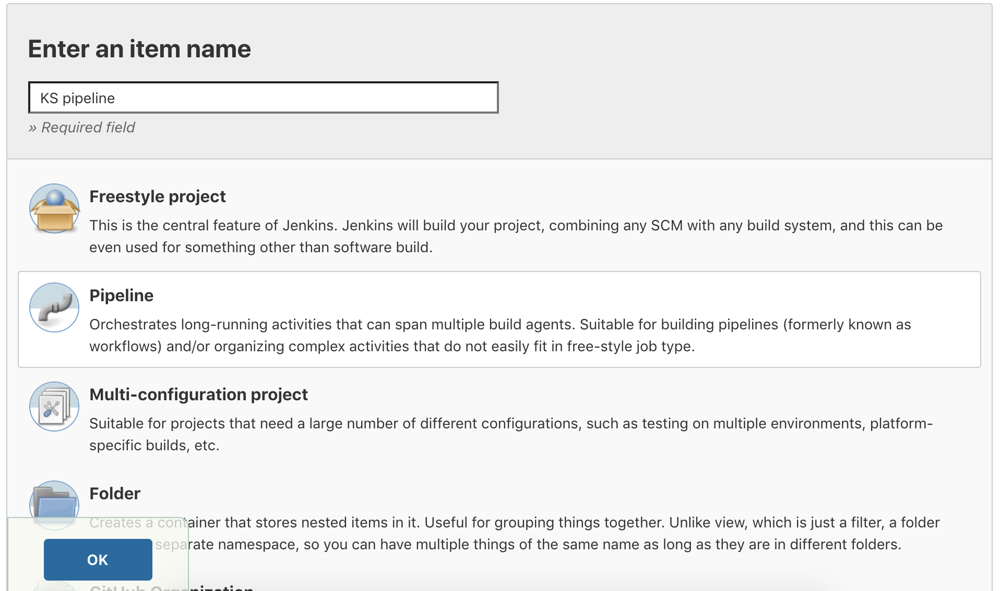
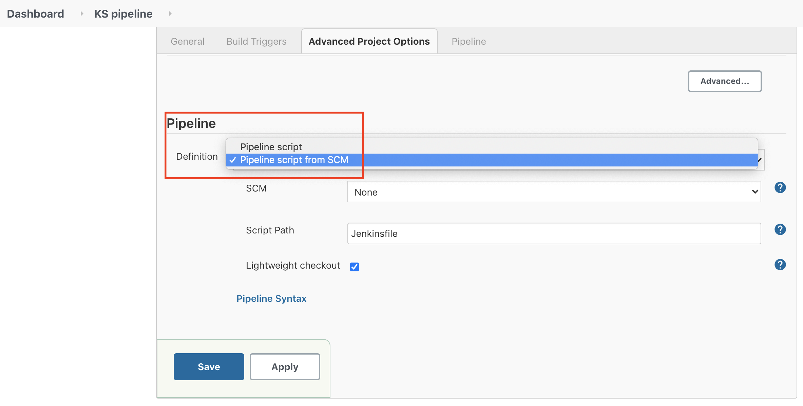
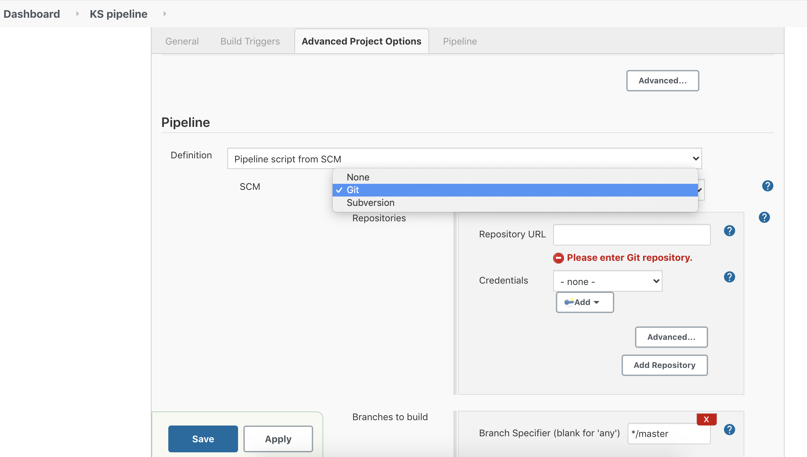

# Windows下Jenkins如何使用Katalon TestOps 插件
Katalon TestOps CI是远程执行Katalon Studio测试或调度远程Katalon Studio执行的一种更简单的方法。

本教程向您展示了如何安装和运行Katalon TestOps - Jenkins插件，用于在Windows平台上进行Web UI测试。

## 运行一个自由风格的Jenkins项目
### 先决条件
* 在Windows上安装Jenkins
* Katalon Runtime Engine 注册码

### 安装Katalon TestOps插件
1. 打开Manage Jenkins -> Manage Plugins -> Available tab and search for the Katalon TestOps plugin.
2. 选择插件并点击安装
    
    
    
### 创建并配置一个自由风格的Jenkins项目
现在回到首页，你可以马上开始使用插件。
1. 点击New Item按钮
    
    
   
2. 选择一个自由风格的项目
    
    
    
3. 指定你的工作空间(这里你可以使用一个Git仓库)。
    > 在 [Github](https://github.com/katalon-studio-samples/ci-samples) 上可以找到一个Katalon Studio项目的样本。

    
    
4. 添加并配置构建步骤:执行Katalon Studio测试。

    
    
    Katalon Studio将根据您指定的版本自动下载和安装。
    
    
    
### 对运行测试后录制的空视频进行故障排除
如果您遇到在Jenkins上运行测试后录制空视频的问题，这是因为Web驱动程序在测试执行期间没有启动。为了解决这个问题，请卸载Windows服务的Jenkins，并替换为包含以下代码的DOS批处理文件:

```
cd D:\Tools\Jenkins //path to Jenkins folder
java -jar --webroot=jenkins.war
```

# 运行 Jenkins Pipeline (Jenkinsfile)
 **先决条件**
    
    * 在Windows上安装Jenkins
    * 在测试机上安装Docker
    * Katalon Runtime Engine 注册码
 
在Jenkins Pipeline中运行Katalon Studio脚本，如下所示:
    
1. 创建一个新的流水线Jenkins项目。

   
   
2. 选择 Pipeline Script from SCM。
    
    
    > 请注意，您需要指定Jenkinsfile路径。
    
3. 在SCM字段中，选择Git。

4. 在Repository URL中，输入存储Katalon Studio项目的Repository URL，或者使用下面的示例项目https://github.com/katalon-studio-samples/ci-samples/blob/master/Jenkinsfile。

     
 
5. 输入您的Git凭据，保存并开始运行Jenkinsfile。
    > 可以再我们的Katalon学院课程中了解更多: [完善您的CI/CD 流水线与自动化测试](https://academy.katalon.com/courses/automated-testing-cicd-pipeline/?utm_source=kat_docs_testops_jenkins&utm_medium=bottom_link&utm_campaign=academy_promotion) 。