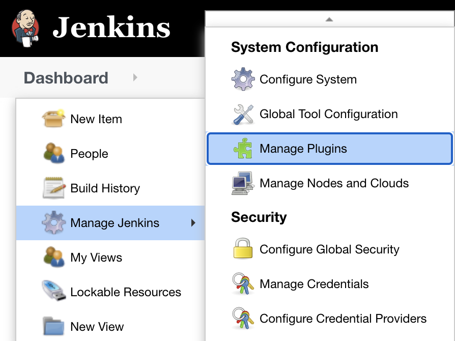
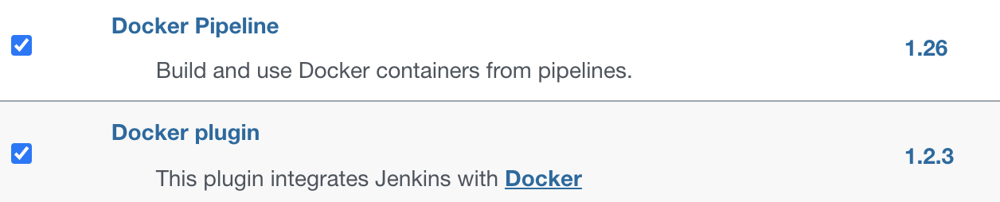
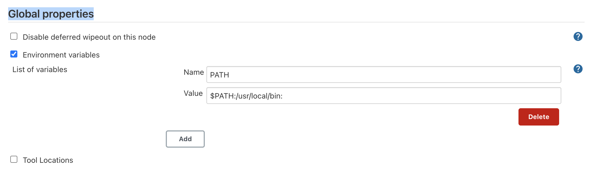
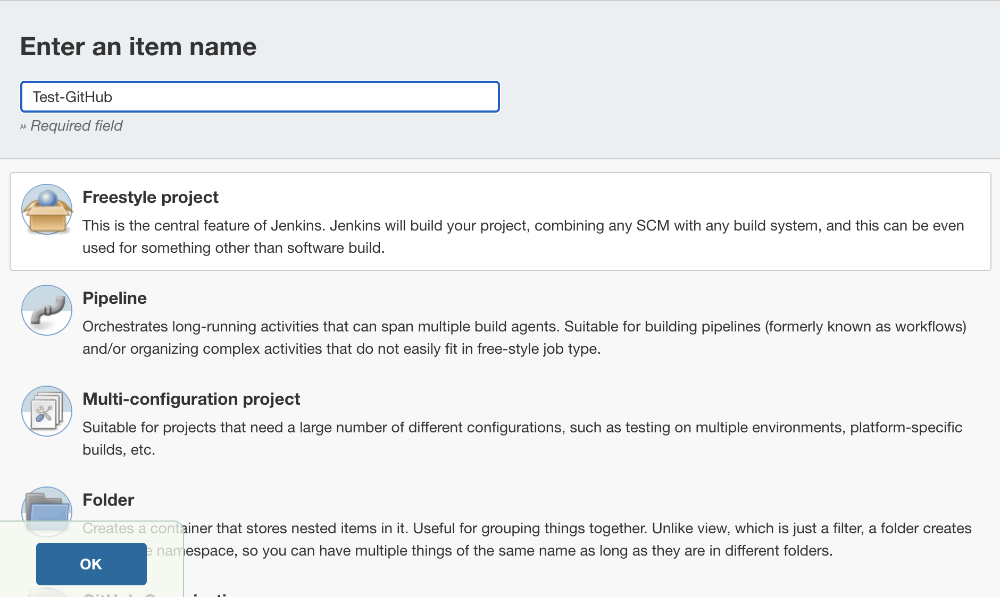
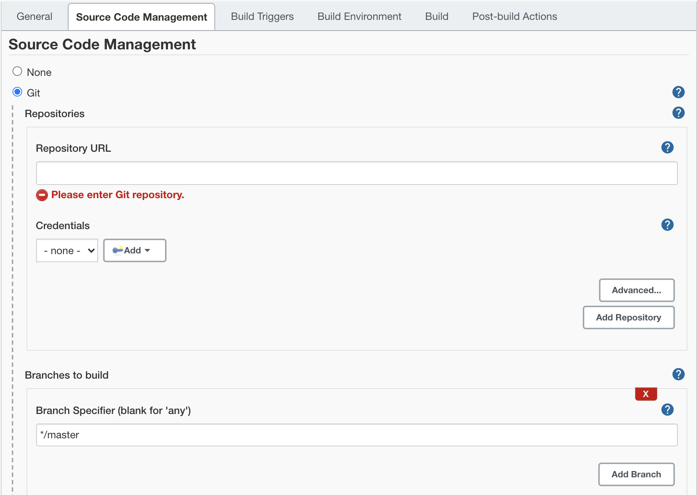
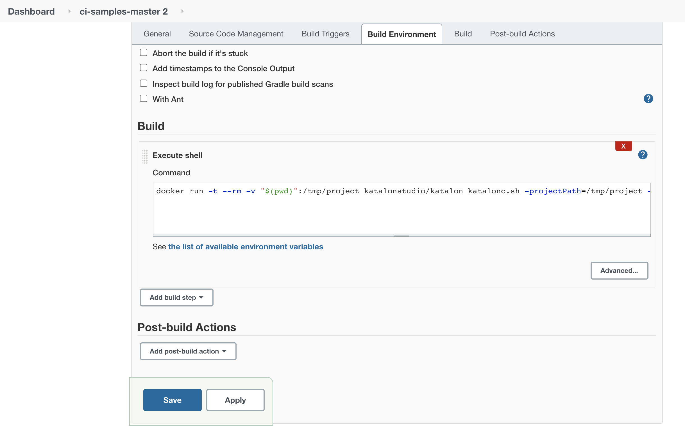
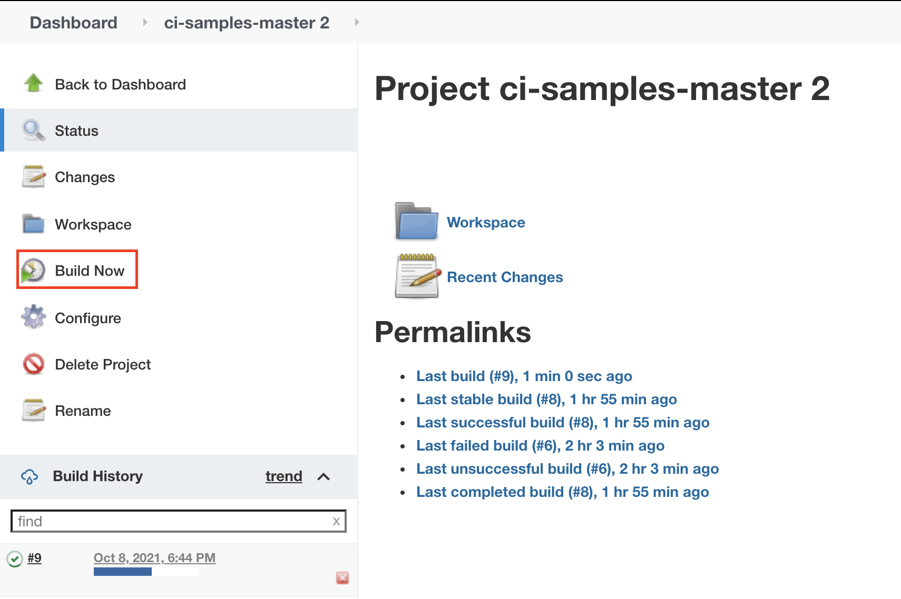
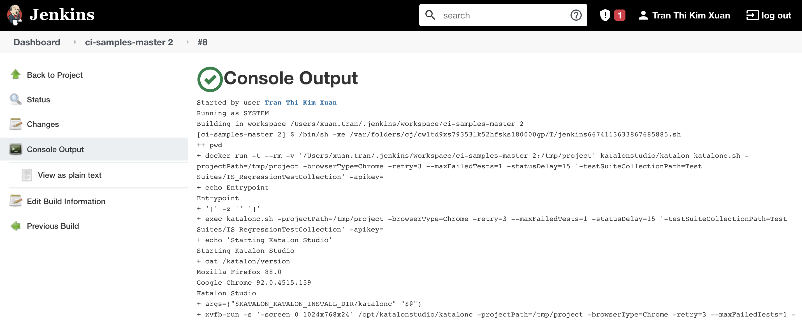
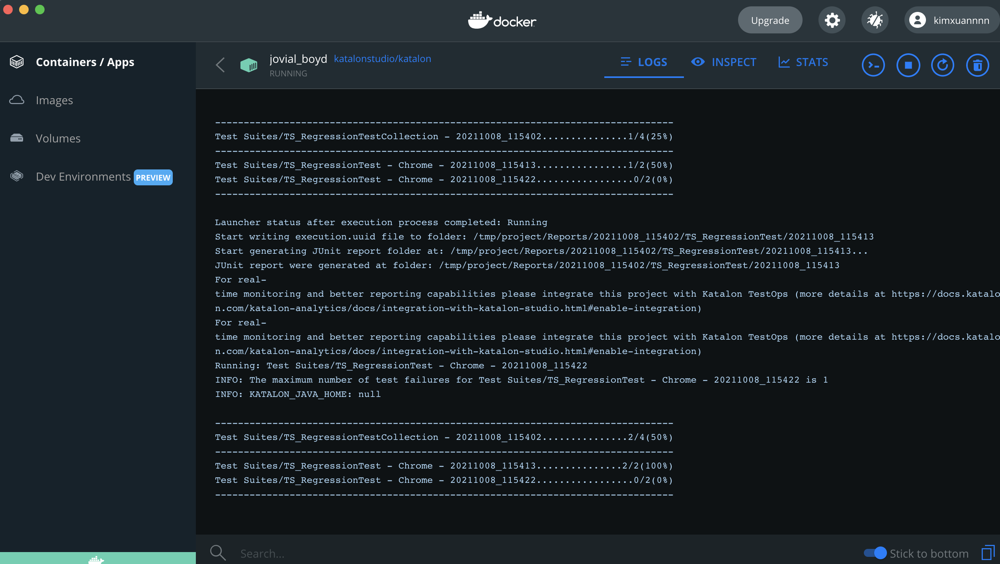

# 在基于Ubuntu的Docker环境中集成Jenkins
> 要求：
>   * Katalon Runtime Engine 注册码
>   * Docker和Jenkins已经安装且配置。按照步骤参见[Docker](https://www.jenkins.io/doc/book/installing/docker/)

Docker是一个在被称为Docker容器的隔离环境中运行应用程序的平台。像Jenkins这样的应用程序可以作为只读图片下载，每个图片都作为一个容器运行在Docker中。

然而，当你的Jenkins安装在一个动态Docker托管在Ubuntu没有GUI，你可能无法配置构建和集成与Katalon Studio从用户界面正常。

本教程将指导你通过Docker托管在Ubuntu上使用Jenkins配置和构建你的Katalon项目。你的Katalon项目将与Katalon工作室Docker图像运行;因此预先安装的Katalon Studio和Katalon运行时引擎在您的本地机器是不需要的。你可以在Docker Hub为Katalon Studio拉Docker Image: [katalonstudio/ Katalon](https://hub.docker.com/r/katalonstudio/katalon) 。

## 在Jenkins中集成Docker
要在Jenkins上集成Docker，你需要安装Docker Plugins和Docker Pipeline，然后设置一个环境变量路径给Jenkins。如下:

### 安装插件

1. 打开Jenkins，然后进入 Dashboard -> Manage Jenkins -> Manage Plugins。

    
    
2. 弹出“插件管理器”页面。在可用选项卡中，搜索Docker Plugin和Docker Pipeline，然后选择

    
    
3. 点击 Install without restart。

### 添加环境变量路径
要在Jenkins中运行Docker命令，需要在Jenkins中添加一个环境路径。PATH指定在哪里可以找到包含Docker命令的文件夹。

进入“Dashboard -> Manage Jenkins -> Configure System -> Global properties”。选择Environment变量来添加一个名为PATH的全局变量，其值为:$PATH:/usr/local/bin:。




## 在Jenkins中上传Katalon项目
> 注意事项：
>* 确保你打开了Docker, Docker Plugin和Docker Pipeline在Jenkins上被激活。
>* 您可以在我们的GitHub库中克隆或下载我们的样本CI/CD项目:[CI sample](https://github.com/katalon-studio-samples/ci-samples) 。

您可以从Git存储库或本地工作区上传Katalon项目。

### 上传Git仓库
1. 在Github上准备Katalon Studio代码仓库。
2. 在Jenkins面板中，点击New Item然后创建一个自由风格项目。

    
    
3. 在源代码管理选项中选择Git。

4. 输入存储库URL，选择要构建的分支、存储库浏览器和其他行为(如果有的话)。

    
    
### 在本地工作区中上传
1. 将您的CI/CD项目文件夹放在以下目录:Users/Your_user_name/.jenkins/workspace。复制项目文件夹名称。

2. 在Jenkins面板中，点击New Item然后并创建一个自由式项目。将项目命名为与本地Jenkins工作空间中的项目文件夹相同的名称。

## 构建项目
1. 在勾选选项中，点击Add build step然后选择Execute shell。输入命令，示例如下：
    ```shell script
    docker run -t --rm -v "$(pwd)":/tmp/project katalonstudio/katalon katalonc.sh -projectPath=/tmp/project -browserType="Chrome" -retry=0 -statusDelay=15 -testSuitePath="Test Suites/TS_RegressionTest" -apikey=<YOUR_API_KEY>
    ```
    
    
    
    > 您可以在[Command Syntax](https://docs.katalon.com/katalon-studio/docs/console-mode-execution.html#general-options) 中找到更多的命令行选项。
    
    在完成以上配置操作后，点击Save。

2. 在项目中，点击Build Now。
    
    

3. 要查看控制台日志，请在Jenkins上单击当前构建并选择console Output。

   在Console Output中，你可以查看Docker开始寻找图像katalonstudio/katalon的状态，验证你的许可证，重新加载插件，然后执行你的测试。如果Docker不能在本地找到katalonstudio/katalon图像，它会自动拉取该图像。
   
   
   
   当测试正在运行时，您也可以在Docker中查看此控制台日志。
   
   
   
4. 您可以进入“Users/Your_user_name/”目录查看报告文件。jenkins/workspace/Your_project_name/Reports或您的第三方集成，如Katalon TestOps, Azure DevOps，或qTest。
   
   > 注意事项：
   > 为了实现实时监控和更好的报告功能，可以考虑将项目与Katalon TestOps集成。也可以在[Upload Test Results to Katalon TestOps from Katalon Studio](https://docs.katalon.com/katalon-analytics/docs/integration-with-katalon-studio.html#enable-integration) 。                                           