# Jira 集成
Katalon Studio可以与Jira Cloud，Jira Server，以及Jira Data Center进行集成。这个集成可以帮助你:

* 链接Katalon Studio项目和Jira项目。
* 从Jira向Katalon Studio中导入用例，用于创建测试用例并运行BDD测试。
* 向链接的Jira缺陷自动提交测试结果和测试报告。
* 把缺陷提交到Jira。

> 要求

* Katalon Studio Enterprise注册码.
* 安装[Jira Integration](https://store.katalon.com/product/3/Jira-Integration) 插件。
* 安装Katalon Studio以及[TestOps Integration](https://marketplace.atlassian.com/apps/1217501/katalon-bdd-test-automation-for-jira) 插件。
# 配置Jira集成工具
启用Jira集成工具，需要按照以下步骤：
1. 进入Project -> Setting -> Plugins -> Jira

2. 选择 Enable integration 复选框
3. 在认证选项中，按照如下所示填写：

    | 名称 | 描述 |
    | -----| ----: |
    | 地址 | Jira地址 |
    | 用户名 | 用户名或者注册Atlassian帐户的电子邮件。 |
    | 密码/令牌 | [Jira令牌管理](https://support.atlassian.com/atlassian-account/docs/manage-api-tokens-for-your-atlassian-account/)  | 

    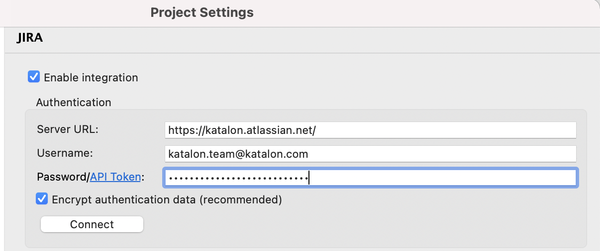

    + 点击链接开始进行认证。弹出如下对话框表明Atlassian帐户连接成功。
    
    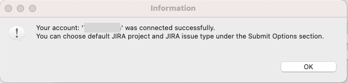

4. Jira 认证成功之后，所有相关的JIRA项目和问题类型将被检索并显示在提交选项部分。您可以在这里指定提交的默认项目和默认问题类型。

    | 名称 | 描述 |
    | :----| :---- |
    | 默认的Jira项目 | 向默认的Jira项目提交问题 |
    | 默认的Jira缺陷类型 | 用户名或者注册Atlassian帐户的电子邮件。 |
    | 使用用例名称作为Jira问题摘要 | 使用用例名称作为Jira问题摘要  | 
    | Jira问题附加截图 | 测试执行提交的缺陷包含截图信息  | 
    | Jira问题附加日志 | 测试执行提交的缺陷包含日志信息  | 
    
    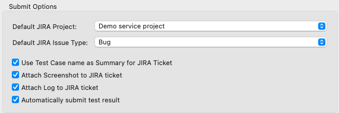
    
5. 点击 Apply and Close 按钮即完成了Jira集成工具的配置
    > 注意事项：
    
    + Jira集成配置仅在项目范围内可用。如果你想在另一个Katalon项目中集成Jira，你必须重复上面的步骤。
    + 如果你想启用Jira与Katalon TestOps的集成，你可以参考这个文档:[TestOps - Jira integration](https://docs.katalon.com/katalon-analytics/docs/kt-jira-config.html) 。
    
# 使用Jira集成工具执行测试用例
在Katalon中执行从Jira导入的测试用例有三个主要步骤。但是，如果你不想运行BDD测试，或者你正在集成Jira Server和Katalon，你可以跳过第1步。

## 步骤1:导入BDD自定义字段(适用于Jira云集成)
从Katalon Studio 7.8.0版本开始，当你为Jira Cloud Integration导入BDD特性文件时，你也可以导入BDD自定义字段到Katalon Studio。要了解更多关于通过Katalon BDD在Jira中添加BDD自定义字段的信息，你可以参考这个文档:配置Jira BDD设置。

步骤如下：
1. 依次打开 Project -> Settings -> Plugins -> Jira。

2. 在“Fetch Options”中，选中“启用检索指定自定义字段的内容”框。

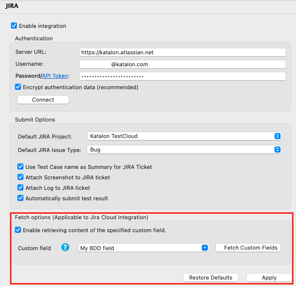

3. 从下拉列表中选择自定义字段。
    > 注意事项
    
    + 只有现有的自定义字段ID对该配置有效。

    + 如果您不能在下拉列表中找到自定义字段，单击Fetch自定义字段从连接的Jira Cloud获取最新的列表。
4. 点击 Apply and Close 按钮应用设置。
## 步骤2:从JIra中导入测试用例
Katalon Studio允许你从Jira拉出测试用例，并将Jira问题链接到Katalon。遵循以下步骤:

1. 从Katalon工具栏中，选择Jira >从Jira JQL导入测试用例。打开一个从JIRA JQL导入测试用例对话框。

    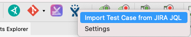

2. 打开对话框后：
    + 在JIRA JQL框中填写所需测试用例的JIRA查询语言(JQL)脚本。要找到您的测试用例的JQL脚本，您可以在这里参考Atlassian文档:使用JQL搜索问题

        例如，我们想要从具有Bug类型和Complete状态的TDAP项目中导入测试用例。使用JQL查询搜索Jira票后，复制并粘贴JQL脚本到Jira JQL框:
        
        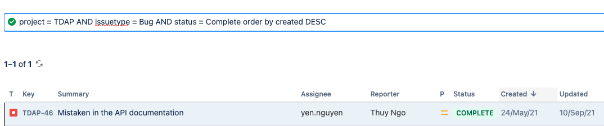
        
    + 默认情况下，选中“导入BDD特性文件”框。该选项允许您导入BDD特性文件以运行BDD测试。如果您不想运行BDD测试，请取消选中此选项。要了解更多关于BDD测试的信息，您可以参考以下文档:
    
        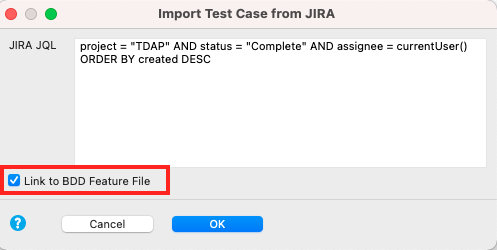
    
3. 在Test Case Folder Selection对话框中，选择存储问题的目标。单击OK。一个Jira问题对话框打开。

    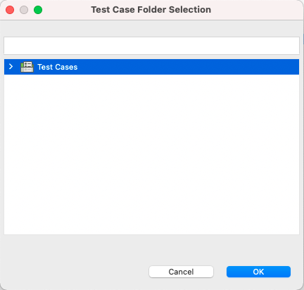
    
4. 在Jira Issues对话框中，点击OK从Jira导入测试用例。
    > 注意事项：
    + 从Jira 问题中仅能导入一次测试用例。你不能重复这个动作。
    
    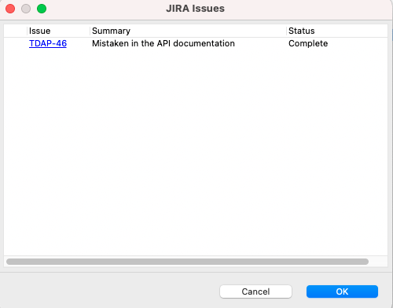
    
    之后，Katalon打开了一个新的测试用例:
    
    | 名称 | 描述 |
    | :----| :---- |
    | 用例名称 | Jira问题的摘要/主题 |
    | 用例描述 | Jira问题内容 |
    | 从步骤2中选择导入BDD特性文件框 | Katalon在Include\ feature中创建一个新的功能文件:  | 
    |  | —特性文件的名称与测试用例的名称相同。  | 
    |  | —特性文件的名称与测试用例的名称相同。  | 
    |  | —在测试脚本中也添加了“运行特性文件”步骤。  | 
    
    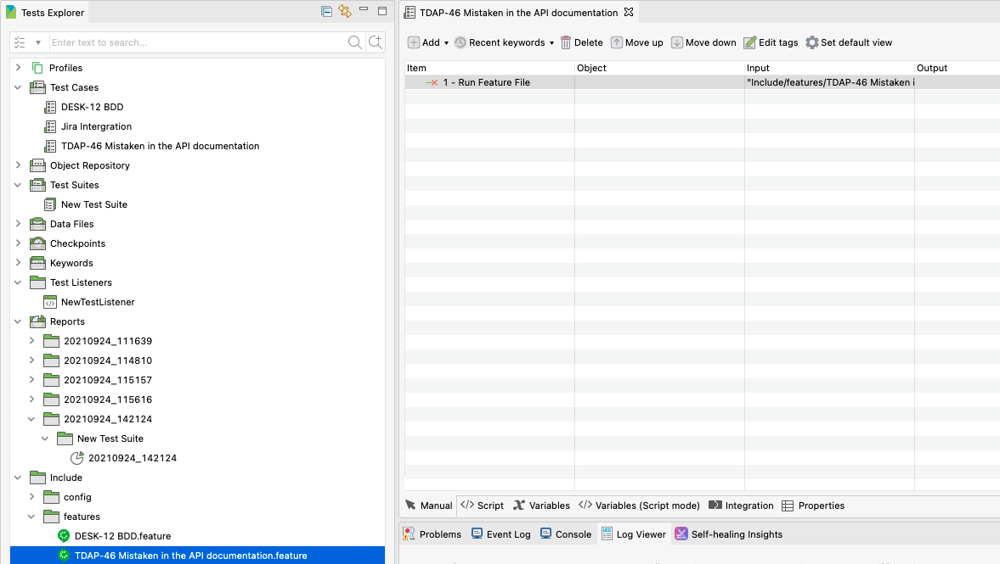
    
    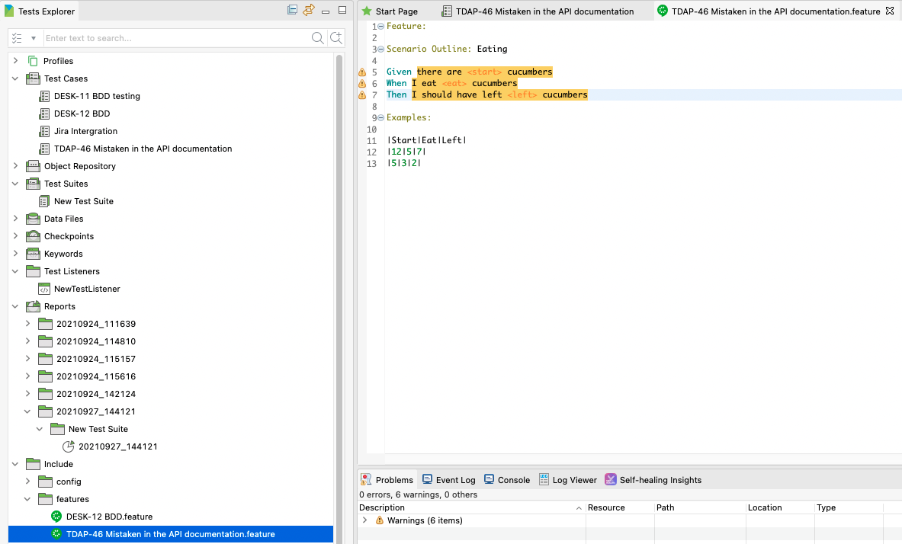

## 步骤3：执行测试用例
从Jira导入测试用例之后，您可以根据需要继续在测试用例中添加额外的步骤。然后点击Run运行测试用例。

# 在Jira中查看测试结果
要在Jira中查看测试结果，请遵循以下步骤:
1. 将相关的测试用例添加到测试套件中。在测试套件执行之后，Katalon Studio自动上传最新的测试结果，并将包含测试报告的.zip文件附加到链接的Jira问题中。
2. 要查看测试结果，请打开链接的Jira问题，单击Details组中的open test results。

    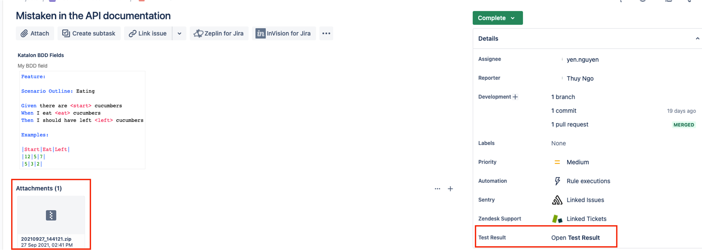

    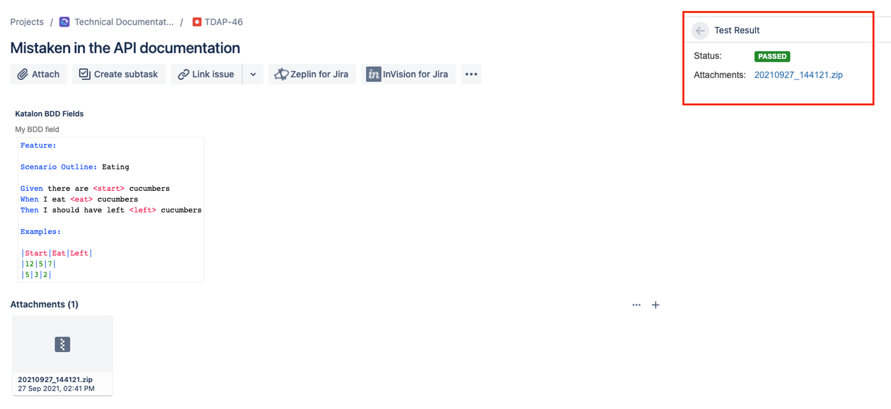
    > 注意事项：
    +  您可以通过JQL查询快速找到测试执行状态。语法如下:“Katalon Status”=< Status >

    + 例如，为了搜索在Katalon Studio测试执行中失败的所有问题，在搜索栏中输入“Katalon Status”=FAIL。Katalon Studio支持五种测试状态:通过，失败，不完整，错误和跳过。

    + 当您在Jira中查看测试结果时，确保您启用了文件附件。要做到这一点，请遵循Jira文档中给出的说明:配置文件附件。
# 提交缺陷到Jira
在执行一个测试套件之后，您可以直接从测试报告页面向Jira提交一个问题。

遵循以下步骤:
1. 进入Test Explorer面板中的Reports，双击打开您想要检查问题的测试报告。
2. 在打开的测试报告中，单击Bug图标。一个链接的Jira问题对话框打开。

    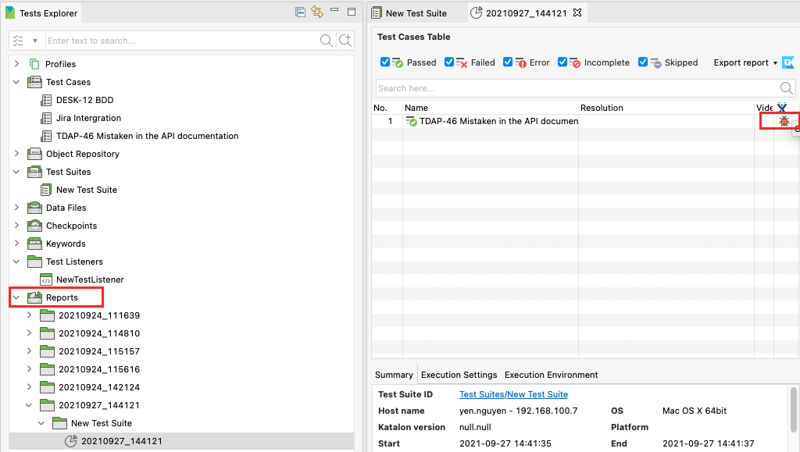

3. 点击Add按钮以选择提交选项

    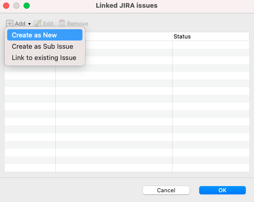

    问题提交选项包括:
    
    | 操作 | 描述 | 步骤 |
    | :----| :---- | :---- |
    | 创建新问题 | 在Jira中新建问题 | 选择此选项后:|
    |  |  | 1. 一个JIRA本地提交表单在弹出式浏览器中打开。您可能会被提示登录到您的Atlassian帐户。你只需要做一次。|
    |  |  | 2. 登入后，填写JIRA本地提交表提交问题。|
    | 创建子问题 | 在已经存在的问题中新建子任务 | 选择此选项后:|
    |  |  | 1. 打开“创建为JIRA子任务”对话框。填写现有Jira问题的ID以在其中创建子任务。单击OK打开JIRA本地提交表单。|
    |  |  | |
    |  |  | 2. 您可能会被提示登录到您的Atlassian帐户。你只需要做一次。|
    |  |  | -登入后，填写JIRA本地提交表格提交问题。|
    | 链接到已经存在问题中 | 这个选项将测试的执行细节添加到现有的JIRA问题中。您需要为此提供现有JIRA问题的ID。 |选择此选项后:|
    |  |  | -一个链接到JIRA问题对话框打开。填写当前Jira问题的ID。单击OK。测试用例执行文件将被附加到链接的JIRA问题。|
    |  |  | |
 
    > 注意事项：
    + 当您向Jira提交问题时，请确保您启用了文件附件。要做到这一点，请遵循Jira文档中给出的说明:配置文件附件。
    + 默认情况下，提交的票据包括测试用例的摘要、描述、截图和日志。您可以在Jira集成设置中的Submit Options部分配置默认的提交表单。
    + 要快速导航到链接的JIRA问题，请单击嵌在票证ID中的超链接。     
    
                                                                                                                                                                                                                                                                                                                                                                                                                                                                                                                                                                                                                                                                                                               
    

    
    