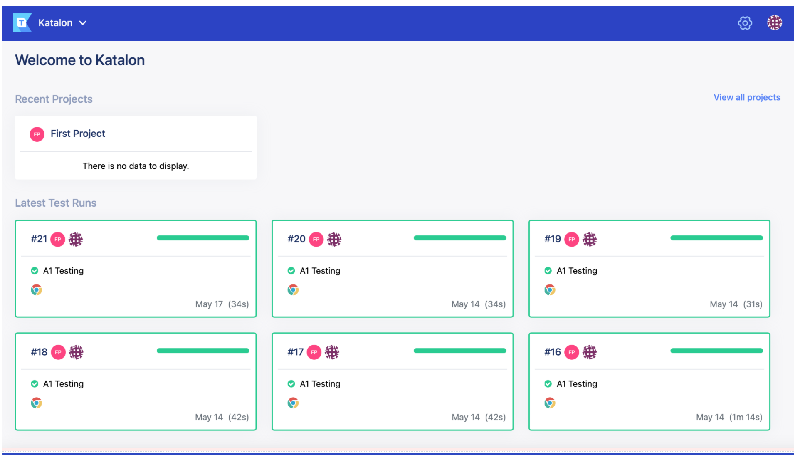
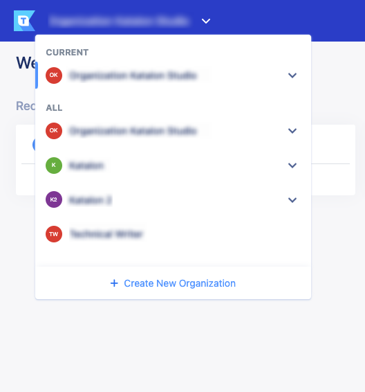
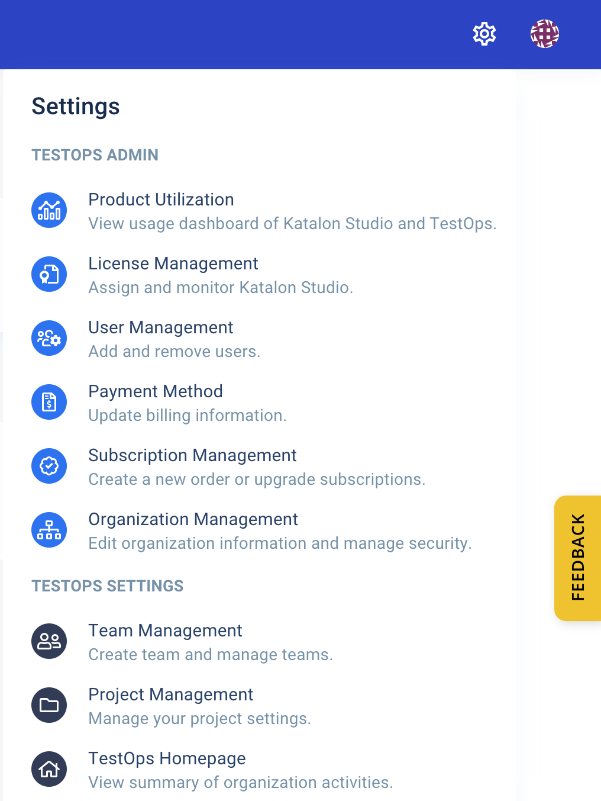
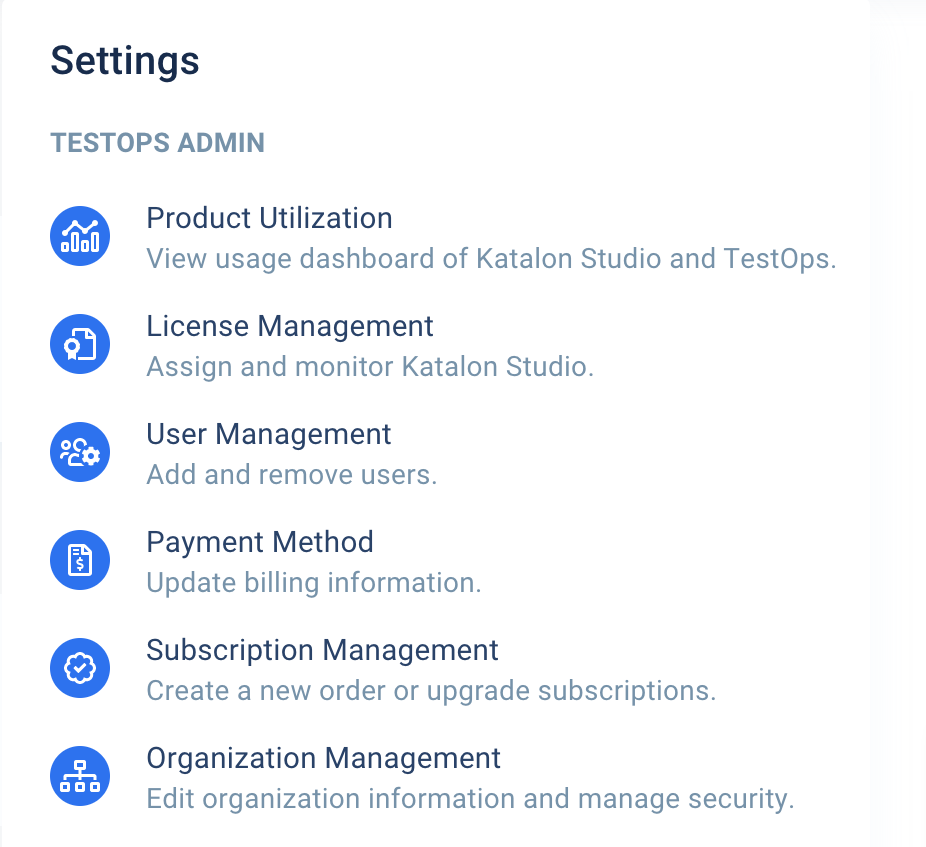
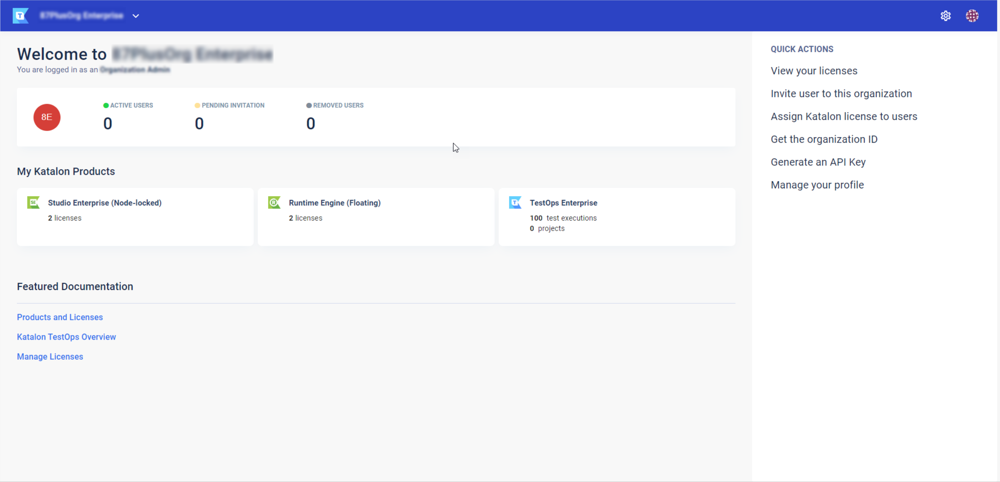
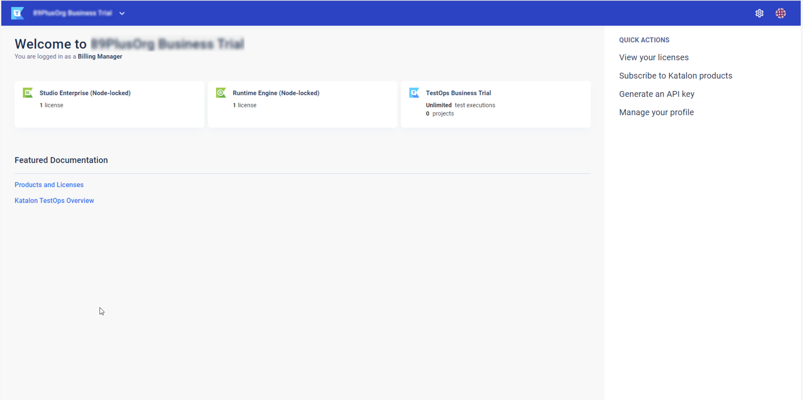

# 了解 Katalon TestOps
本指南旨在帮助您轻松了解Katalon TestOps。
>注:
>
>根据您在组织中的角色，使用Katalon TestOps您将获得不同的用户体验。请参阅:[角色和权限](https://docs.katalon.com/katalon-analytics/docs/testops-roles-privileges.html) 。

Katalon TestOps有两种类型的主页: TestOps主页和管理员主页。
## TestOps主页

testops的主页主要包含活动摘要。

在登录[Katalon TestOps](https://testops.katalon.io/login) 后，TestOps主页显示如下：

在左上角，您可以看到当前组织的名称。如果你点击它，你可以:
* 查看您所属的所有组织的列表。
* 创建一个新的组织。参见:[Create Organization and Project](https://docs.katalon.com/katalon-analytics/docs/kt-create-org.html) 。

    
    
在右上角，如果你点击头像图标，你可以看到常见的个人设置操作。

 | 个人设置选项 | 功能描述 |
 | -----| ----: |
 | View Profile | 查看账户信息 |
 | Notification Settings | 配置通知及Katalon API密钥。 |
 | Feature Request | 发送需求到github。 |
 | Bug Reports | 提交缺陷到到github。 |
 | Documentation | 查找使用Katalon产品的教程和指南。 |
 | Community | 加入我们的Katalon社区，看看所有的社区论坛。 |
 | Sign Out | 退出登录。 |
 
 
 
在右上角，如果单击Settings图标，可以看到两个不同的部分:TestOps Admin和TestOps

**设置**
* TestOps Admin是一个全面的管理工具，允许您管理所有Katalon产品(Studio, Runtime Engine, TestOps)。
* TestOps Settings是一个专门用于Katalon TestOps产品的配置工具。
    
    
TestOps Settings部分包含以下页面:
 
 | TestOps设置页面 | 功能描述 |
 | -----| ----: |
 | 团队管理 | 管理你全部的TestOps团队 |
 | 项目管理 | 管理你全部的TestOps项目 |
 | TestOps主页 | 查看活动摘要 |
 
根据您在当前组织中的角色，可用的TestOps管理控制台页面是不同的。

### 作为所有者：

 | TestOps管理员控制台页面| 功能描述 |
 | -----| :---- |
 | Product Utilization | 查看您的产品使用情况，参见：[License Utilization Dashboard](https://docs.katalon.com/katalon-studio/docs/license-utilization-dashboard.html) |
 | License Management | 分配与删除许可，参见：[Manage Katalon Licenses](https://docs.katalon.com/katalon-studio/docs/license-management.html) |
 | User Management | 邀请成员到组织中，编辑他们的角色，或删除组织中的成员。参见：[TestOps User Management](https://docs.katalon.com/katalon-analytics/docs/kt_invite_user_org.html) |
 | Payment Method | 更新订单信息，参见：[Change Billing Information](https://docs.katalon.com/katalon-studio/docs/billing-info.html) |
 | Subscription Management | 创建一个新订单并升级您的订阅，参见：[Create TestOps subscriptions and Purchase Katalon Licenses](https://docs.katalon.com/katalon-analytics/docs/testops-subscriptions.html) |
 | Organization Management | 编辑组织信息和安全设置。 |
 
### 作为管理员：

 | TestOps管理员控制台页面| 功能描述 |
 | -----| :---- |
 | Product Utilization | 查看您的产品使用情况，参见：[License Utilization Dashboard](https://docs.katalon.com/katalon-studio/docs/license-utilization-dashboard.html) |
 | License Management | 分配与删除许可，参见：[Manage Katalon Licenses](https://docs.katalon.com/katalon-studio/docs/license-management.html) |
 | User Management | 邀请成员到组织中，编辑他们的角色，或删除组织中的成员。参见：[TestOps User Management](https://docs.katalon.com/katalon-analytics/docs/kt_invite_user_org.html) |
 | Organization Management | 编辑组织信息和安全设置。 |
 
### 作为账单管理员：

 | TestOps管理员控制台页面| 功能描述 |
 | -----| :---- |
 | License Management | 分配与删除许可，参见：[Manage Katalon Licenses](https://docs.katalon.com/katalon-studio/docs/license-management.html) |
 | Payment Method | 更新订单信息，参见：[Change Billing Information](https://docs.katalon.com/katalon-studio/docs/billing-info.html) |
 | Subscription Management | 创建一个新订单并升级您的订阅，参见：[Create TestOps subscriptions and Purchase Katalon Licenses](https://docs.katalon.com/katalon-analytics/docs/testops-subscriptions.html) |
 
### 作为成员：

成员无法访问TestOps管理控制台页面。

## 管理员主页
> 注:
>
>只有Owner、Admin和Billing Manager才能访问Admin主页。

管理员主页导航：
1. 在TestOps页面的右上角，单击Settings图标。在显示的TestOps Admin部分中，导航到TestOps Admin Console页面之一。
    
    
    
2. 从管理控制台页面的左上角，单击TestOps图标。您将被导航到Admin主页。
    
      
      
根据您在当前组织中的角色，Admin主页中的导航会有所不同。
 
### 作为所有者或管理员：
Admin主页如下所示：

Admin主页显示的几部分内容中包含了Admin的常见操作。

 | 选项| 常用动作和用法 |  |
 | -----| ----- | :---- |
 | User Summary | Active Users | 查看加入组织的用户数。 |
 | User Summary | Pending Users | 查看向您的组织发出暂挂邀请的用户数量。 |
 | User Summary | Removed Users | 查看从组织中删除的用户数量。 |
 | My Products | License summary | 查看购买的license类型以及每种license的license数量。 |
 | My Products | TestOps plan summary | 查看计划名称、购买的测试执行的数量，以及您所属的项目的数量。 |
 | Featured Documentation | 查看TestOps知识库中的一些特色用户指南。 |  |
 | Quick Actions | View your licenses | 查看以购买许可证详情 |
 | Quick Actions | Invite user to this organization | 邀请用户加入你的组织 |
 | Quick Actions | Subscribe to Katalon products (for Owner only) | 创建TestOps订阅。 |
 | Quick Actions | Assign Katalon license to users | 向用户授权许可 |
 | Quick Actions | Get the organization ID | 获取组织机构ID |
 | Quick Actions | Generate an API key | 生成API密钥，将TestOps与不同平台集成。|
 | Quick Actions | Manage your profile | 编辑你的个人设置 |
 
### 作为账单管理员：

 Admin主页如下所示：
 
 
 
 Admin主页显示的几部分内容中包含了账单管理的常见操作。
 
 | 选项| 常用动作和用法 |  |
 | -----| ----- | :---- |
 | My Products | License summary | 查看购买的license类型以及每种license的license数量。 |
 | My Products | TestOps plan summary | 查看计划名称、购买的测试执行的数量，以及您所属的项目的数量。 |
 | Featured Documentation | 查看TestOps知识库中的一些特色用户指南。 |  |
 | Quick Actions | View your licenses | 查看以购买许可证详情 |
 | Quick Actions | Subscribe to Katalon products (for Owner only) | 创建TestOps订阅。 |
 | Quick Actions | Generate an API key | 生成API密钥，将TestOps与不同平台集成。|
 | Quick Actions | Manage your profile | 编辑你的个人设置 |
 
### 作为成员：
Admin主页如下所示：

Admin主页显示了几个包含成员常用操作的部分。

 | 选项| 常用动作和用法 |  |
 | -----| ----- | :---- |
 | TestOps plan summary | 查看计划名称、购买的测试执行的数量，以及您所属的项目的数量。  | |
 | Featured Documentation | 查看TestOps知识库中的一些特色用户指南。 |  |
 | Quick Actions | View your licenses | 查看以购买许可证详情 |
 | Quick Actions | Generate an API key | 生成API密钥，将TestOps与不同平台集成。|
 | Quick Actions | Manage your profile | 编辑你的个人设置 |