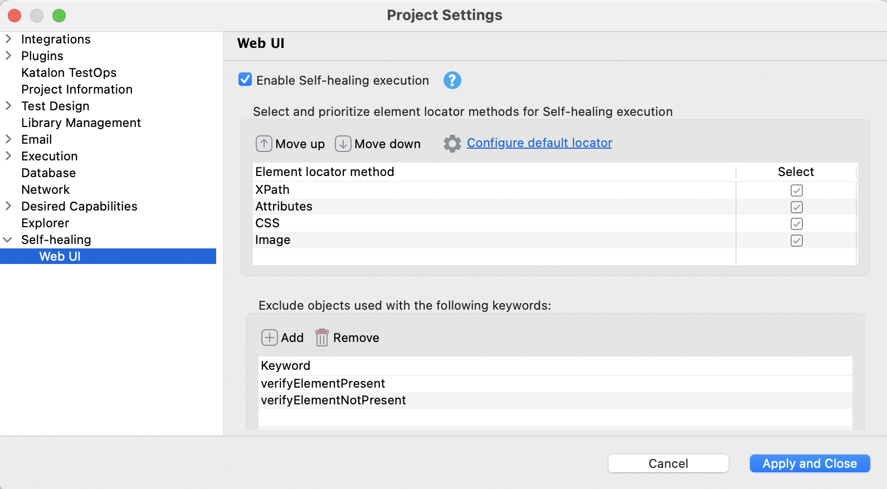
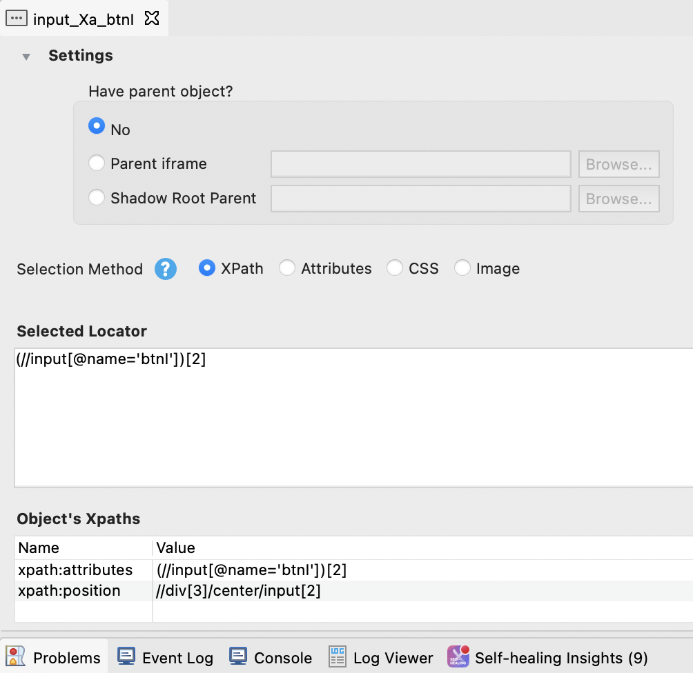
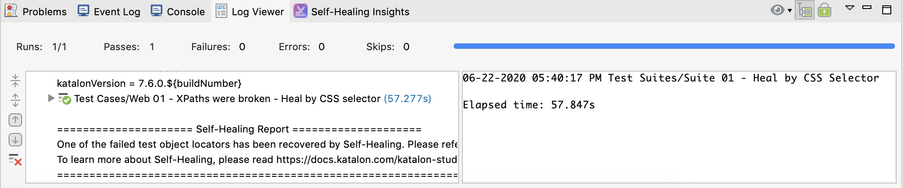
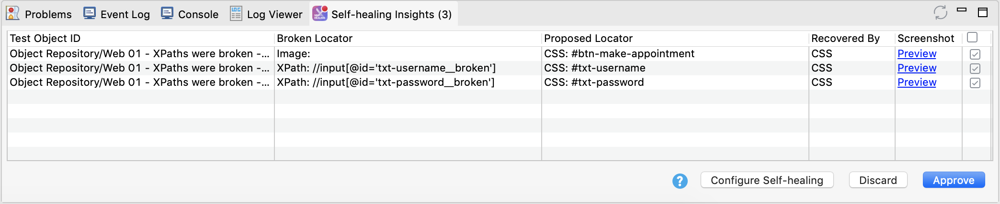

# 自动修复测试？
> 要求
* Katalon Studio版本高于7.6.0版本
* Katalon Studio 企业版的激活码

当被测试的应用程序(AUT)更改时，定位对象可能会损坏或无法识别目标元素。因此，创建和使用正确的、有弹性的定位器对Web UI测试自动化的成功至关重要。

从7.6.0版本开始，Katalon Studio支持自修复机制来解决执行过程中损坏定位器的问题。这个特性可以大大减少您的测试维护工作，特别是当测试用例在夜间批量运行时。

本文将知道您：
* 了解自动修复机制
* 使用自动修复模式配置和执行测试
* 查看自动修复模式识别和替换无效的定位器

我们还提供了一个示例项目供您尝试。你可以从我们的GitHub库中克隆或下载这个示例项目:[Self-healing sample project](https://github.com/katalon-studio/self-healing-demo#self-healing-sample-project)

## 自我修复机制

启用自愈功能后，当Katalon Studio无法使用其默认定位器找到一个对象时，Katalon会尝试与该对象关联的其他预先配置的定位器。

如果Katalon Studio通过任何替代定位器找到一个对象，测试将继续运行。一旦损坏的对象自我修复，成功找到该对象的替代定位器将用于剩余的执行。这有助于缩短执行时间，因为它防止了对同一个损坏的对象一次又一次地发生自修复。

当测试执行结束时，Katalon Studio建议用找到对象的定位器替换坏掉的定位器。除非Katalon Studio能够找到目标对象(取决于您所设计的失败处理选项)，否则测试执行可能会停止或继续。有关失败处理选项的详细信息，请参见失败处理。

## 测试设计配置
想要学习更多测试设计配置，请在 [Configure Test Design](http://docs.katalon.com/katalon-studio/docs/web-selection-methods.html#configure-test-design) 中查看。

## 执行自动修复配置
### 自动修复模式的启用和禁用

在Katalon Studio中，自动修复模式默认是启用的。想要禁用自动修复模式，有以下两种方式：
* 在Project -> Setting -> Self-Healing -> WebUI，然后反选“启用自我修复执行”选项。 
* 从Katalon Studio的工具栏中，单击Self-Healing图标，然后选择Disable Self-healing。

### 定位方法
当定位失败时，可以通过在全局设置中设置优先级顺序来决定先尝试哪个替代定位方法。


在为自我修复执行选择元素定位方法并按优先级排序这一行下，您可以找到元素定位方法表。
1. 选择一种或多种用于自动修复测试的选择方法：

    - XPath：如果Katalon未能识别到具有默认Xpath值的对象，则会自动应用其他XPath选项。
    - Attributes
    - CSS
    - Image：图像识别允许使用图像来表示并识别到该对象。
2. 通过向上或向下排列这些方法的优先级。
3. 如果你点击“Configure default locator”，则会被重定向到“Test Design”选择界面。
### 排除使用关键字的对象

在某些场景中，您不需要测试引擎来尝试不同的定位器来查找不存在的对象。因此，当检测带有特定关键字的对象时，可以关闭自愈模式。例如，verifyElementPresent和verifyElementNotPresent在默认情况下被排除。

如果需要将某个关键字排除在自动修复模式之外，请执行如下操作:
1. 在 Project -> Setting -> Self-Healing -> WebUI 页面配置。
2. 在 Exclude objects used with the following keywords 选择界面, 点击 Add。
3. 将要从自动修复模式中排除的关键字插入例外列表。

当对象与该字段中的指定关键字一起使用时，Katalon Studio不会尝试使用自修复模式定位该对象。

例如：
将verifyElementPresent关键字添加到例外列表中。在您的测试中，input_Username_username对象的默认定位方法被破坏了。
运行以下测试脚本：
```
WebUI.openBrowser('https://katalon-demo-cura.herokuapp.com/')
WebUI.click(findTestObject('null'))
def username = findTestObject('Object Repository/Page_CURA Healthcare Service/input_Username_username')
WebUI.setText(username, 'John Doe')
WebUI.verifyElementPresent(username, 5)
```
由于verifyElementPresent被排除在自动修复之外，input_Username_username对象不能自动修复，测试如预期的那样失败。

### 覆盖对象视图
在对象视图中，您可以决定在执行期间用于检测对象的默认选择方法。此配置会覆盖 Self-Healing -> Web UI ->Test Execution 中的全局设置。



### 自动修复机制详解
在运行自动修复测试之后，你可以在 Log Viewer 中查看 Self-Healing Report。


在Log Viewer选项卡的旁边，Self-healing Insights选项卡显示了一个表，其中包含替换坏掉的定位器的所有建议。表包括:
* Test Object ID：损坏测试对象的ID。
* Broken Locator：在执行期间无法检测对象的默认定位方法。
* Proposed Locator：在执行期间定位对象的备用定位器。如果对象是通过屏幕截图找到的，那么建议的定位器就是该元素新生成的智能XPath。
* Recovered By：Katalon Studio用于检测对象的选择方法。
* Screenshot：当用它的替代定位器找到一个对象时，Katalon会捕获测试对象的屏幕截图，以便您验证找到的对象是否是需要的对象。单击“预览”查看修复后的对象。
* Select：决定哪个定位器为您采取行动。



在测试运行期间，定位器替换是临时的。在自动修复详情中，您可以发现已在运行时恢复的损坏的定位器。

验证找到的对象是否是您所期望的对象。您可以选择一个或多个建议的定位器，然后单击:
* Approve: 应用。
* Discard: 拒绝。

> 已知限制
* 仅在Web UI测试中可用
* 基于图像的测试:在记录和检查期间，您必须决定将哪些元素捕获为图像以创建图像属性。有时候很难知道在执行过程中哪些元素会被破坏。这意味着您必须手动捕获所有元素，或者决定某些元素可能具有弹性，应该使用镜像进行备份。


