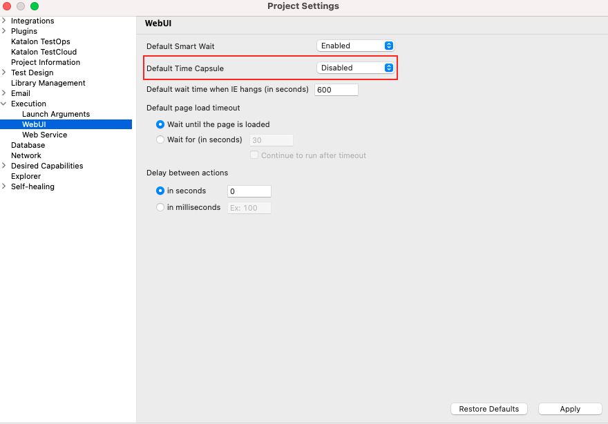

#通过Time Capsule修复损坏的Web测试对象
以前，要修复损坏的测试对象，您必须在失败时手动地重现测试下应用程序(AUT)的状态。这种方法很耗时。使用使用数据驱动测试框架的自动化测试，当有大量的测试数据时，手动地重现AUT的准确状态会更加繁琐、复杂和累人。

为了解决这个问题，Katalon Studio 7.8支持在测试由于定位器没有找到Web UI对象而失败时将AUT恢复到状态。这个强大的功能允许您打开一个“时间胶囊”来修复损坏的对象，减少复制工作，并减少花费在故障排除和维护测试脚本上的时间。

值得注意的是，有两个增强可以帮助你优化修复测试的工作流程:
1. 测试引擎在发生故障时自动捕获AUT的快照(以HTML格式)。存储在项目的Report文件夹中的快照允许您在项目失败时穿越到AUT的状态。
2. 对于一个特殊的例外```com.kms.katalon.core.webui.exception.WebElementNotFoundException: Web element with id ... not found```，您可以在测试用例或测试套件报告的日志查看器中触发“时间胶囊”。
> 仅适用于Chrome浏览器的Web UI测试。


本文档向您展示了如何打开/关闭Time Capsule，以及在以下使用示例中，当一个测试用例或测试套件失败时，如何触发“Time Capsule”。

## 开启/关闭 Time Capsule
这个扩展的类似于默认智能等待。禁用时，Time Capsule扩展将不会安装，也不会生成。
### 7.8.2之前的版本
默认启用Time Capsule
### 大于7.8.2的版本
开启/关闭Time Capsule，按如下操作进行：
1. 依次点击Project -> Setting -> Execution -> WebUI
2. 在Default Time Capsule的下拉列表中，选择Enabled/Disabled ,然后点击OK按钮

##测试用例执行失败的场景
测试用例执行时一旦出现由于``com.kms.katalon.core.webui.exception.WebElementNotFoundException: Web element with id ... not found.```的错误，在用例的Log Viewer窗口，你可以点击”Click here to fix broken Test Object“，使用Spy工具自动打开AUT捕获的状态。

##测试套件执行失败的场景
类似地，当一个测试套件包含至少一个由于损坏的定位器而失败的测试用例时，在测试套件的结果/报告中，您可以单击链接“click here to fix broken Test Object”，使用Spy工具自动打开AUT捕获的状态。
